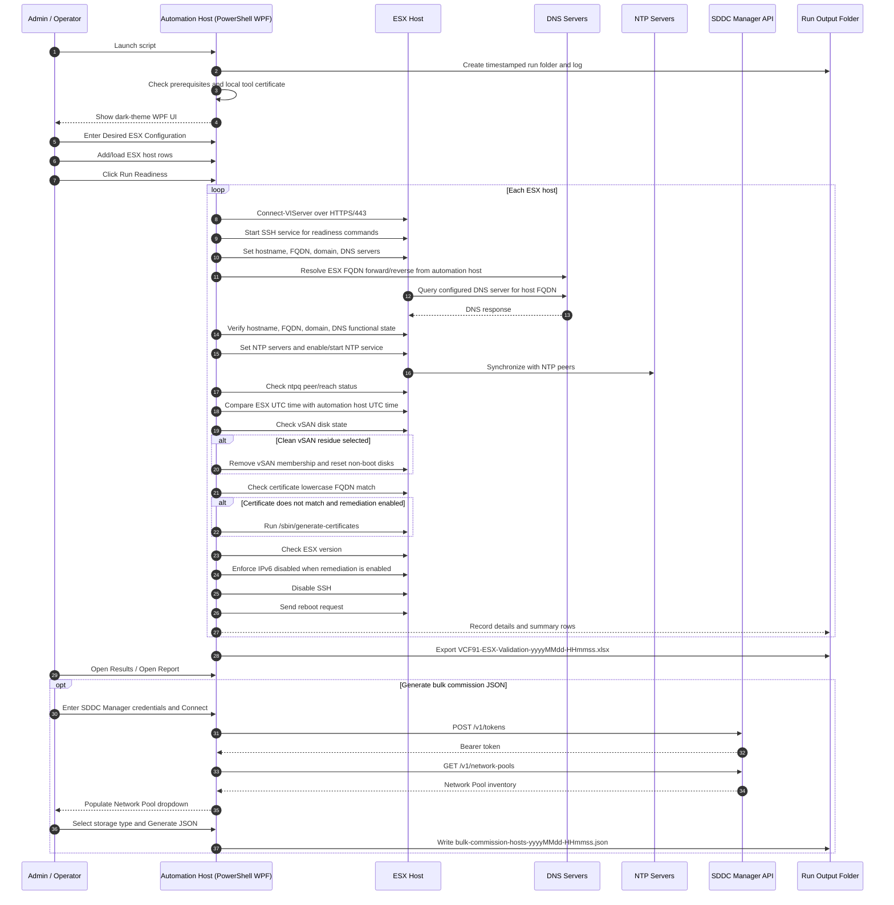

## VCF 9.1 ESX Host Validation and JSON Generator

PowerShell 7 / WPF utility for validating, remediating, and documenting **VCF 9.1 ESX host readiness** before host commissioning, with integrated **bulk host commission JSON generation**.

**Current documented release:** v1.0 
**Script file name:** VCF91-ESX-Validation-JSON-Generator-v1.0.ps1

**Author** Michael Molle

This tool connects directly to standalone ESX hosts using PowerCLI and SSH, applies the desired ESX configuration, validates readiness, exports an Excel readiness report, and generates the VCF / SDDC Manager compatible host commissioning JSON file.

### Purpose

This tool provides an operator-friendly Windows UI for preparing ESX hosts for VCF 9.1 commissioning.

The script is intended for environments where an administrator needs to:

- Validate multiple ESX hosts from a single UI.
- Set hostname, lowercase FQDN, domain/search suffix, and DNS servers.
- Validate DNS forward and reverse records.
- Validate DNS query reachability from each ESX host to configured DNS servers.
- Configure NTP servers and start/enable the NTP service.
- Validate NTP synchronization and capture time drift from the automation workstation.
- Validate and regenerate ESX certificates so the certificate name matches the lowercase host FQDN.
- Validate ESX version is VCF 9.1 ready.
- Validate and enforce IPv6 disabled, with reboot-required reporting.
- Validate vSAN disk readiness and optionally clean vSAN residue from non-boot disks.
- Disable SSH after the workflow completes.
- Reboot hosts after remediation.
- Load SDDC Manager network pools and generate bulk host commission JSON.
- Generate a consistent timestamped run folder, log file, readiness report, and JSON output file.

### Supported Use Case

Use this tool when preparing standalone ESX hosts for VCF 9.1 commissioning.

Common scenarios include:

- Preparing hosts before importing or commissioning them into VCF.
- Correcting host identity, DNS, NTP, certificate, and IPv6 readiness items before VCF workflows.
- Producing an auditable Excel report showing host readiness status and detailed evidence.
- Generating a VCF host commissioning JSON file from the same host list used for validation.
- Re-running validation safely after host reboots to confirm final state.

### Requirements

- Windows automation host or jump host.
- PowerShell 7 or later recommended.
- WPF-capable Windows session.
- VMware PowerCLI module.
- Posh-SSH module.
- ImportExcel module recommended for `.xlsx` report output.
- Network connectivity from the automation host to each ESX host over HTTPS/443.
- SSH connectivity from the automation host to each ESX host over TCP/22 when remediation/readiness shell checks run.
- ESX credentials, typically `root`, for the hosts being prepared.
- DNS records already created for each ESX host FQDN.
- Network connectivity from each ESX host to the configured DNS and NTP servers.
- Optional SDDC Manager connectivity over HTTPS/443 for Network Pool inventory and JSON generation.

### Input Model

The Validation tab accepts host rows directly in the UI or through CSV load/save.

Expected CSV columns:

```csv
TargetHost,Username,Password
pod01esx12.corp.example.com,root,VMware1!
pod01esx13.corp.example.com,root,VMware1!
```

#### Validation CSV Column Behavior

<table>
<tr><th>Column</th><th>Required</th><th>Description</th></tr>
<tr><td>TargetHost</td><td>Yes</td><td>Lowercase ESX host FQDN to validate and remediate.</td></tr>
<tr><td>Username</td><td>No</td><td>ESX username. Defaults to root when blank.</td></tr>
<tr><td>Password</td><td>Yes</td><td>ESX password used for PowerCLI and SSH operations. Passwords are not written to the script configuration.</td></tr>
</table>

### Desired ESX Configuration

The top-right UI panel contains the desired host configuration used by the readiness workflow.

Required fields:

- **DNS servers** — one or more DNS server IP addresses separated by comma, semicolon, space, or newline.
- **Search domains** — desired ESX domain/search suffix. The first entry is used as the primary ESX domain.
- **NTP servers** — one or more NTP server names/IPs separated by comma, semicolon, space, or newline.

Options:

- **Apply remediation** — apply desired configuration and enforce remediations.
- **Clean vSAN residue** — destructive option that removes vSAN membership and resets non-boot disks to GPT after operator confirmation.

### UI Workflow

The UI is organized into these areas:

- **Prerequisites**
  - PowerShell version.
  - VMware PowerCLI status.
  - ImportExcel status.
  - Posh-SSH status.
  - Install buttons for missing modules.
- **Desired ESX Configuration**
  - DNS servers.
  - Search domains.
  - NTP servers.
  - Apply remediation.
  - Clean vSAN residue.
- **Validation**
  - Host FQDN.
  - User Name.
  - Password.
  - Run Readiness.
  - Add Host.
  - Remove Selected.
  - Load CSV.
  - Save CSV.
  - Download Example CSV.
- **Results**
  - Host-level readiness results.
- **JSON Generator**
  - SDDC Manager FQDN.
  - User.
  - Password.
  - Network Pool Name inventory.
  - Storage Type.
  - Connect.
  - Generate JSON.
- **Log**
  - Timestamped execution log in the UI and run folder.

### How the Script Works



### Readiness Checks and Remediation Behavior

#### Hostname / DNS / Domain Set

When **Apply remediation** is selected, the script sets:

- short hostname from the FQDN host prefix.
- lowercase FQDN from the host row.
- domain from the Search domains field.
- DNS servers from the DNS servers field.
- DNS search suffix from the Search domains field.

The script attempts PowerCLI first and then uses ESX shell commands as fallback/confirmation.

#### Hostname / DNS / Domain Verify

The script separately verifies:

- Hostname matches the host row short name.
- FQDN matches the lowercase host row FQDN when ESX reports it.
- Domain matches the desired domain.
- DNS server list contains the desired DNS servers, or DNS functional query succeeds when ESX DNS list parsing returns blank.

This prevents false failures when ESX command output does not render DNS server inventory as expected but DNS resolution from the host is working.

#### DNS Forward / Reverse

The automation host validates:

- forward A record lookup for the ESX FQDN.
- reverse PTR lookup for the returned address.
- PTR result matches lowercase ESX FQDN.

#### DNS Reachability

Each ESX host queries the configured DNS servers. The check passes when at least one configured DNS server successfully resolves the ESX FQDN.

#### NTP Config and Sync

The script sets desired NTP servers when needed, starts/enables the NTP service, checks NTP peer state, and retries synchronization checks. If NTP has not selected or reached a peer by attempt 5, the script restarts the NTP service and continues checking.

#### Time Drift

The script records:

- automation host UTC time.
- ESX host UTC time.
- drift in seconds.
- absolute drift in seconds.

The Time Drift check is intended to provide additional evidence when NTP status is ambiguous.

#### Certificate

The script checks certificate subject/SAN names and requires the lowercase ESX FQDN to pass. If the certificate does not match and remediation is enabled, the script runs:

```bash
/sbin/generate-certificates
```

The host reboot at the end of the workflow reloads the management services.

#### IPv6

When **Apply remediation** is selected, v40 always enforces IPv6 disabled and records the result as `Remediated` because ESXi requires reboot before DCUI and the management stack reflect the final disabled state.

The script runs:

```bash
esxcli network ip set --ipv6-enabled=false
esxcli system settings advanced set -o /Net/IPv6Enabled -i 0
```

The report includes IPv6 evidence before and after the disable request.

#### vSAN

Without cleanup selected, the script reports vSAN disk state and treats **Eligible for use by VSAN** as pass.

When **Clean vSAN residue** is selected, the script prompts for confirmation before destructive cleanup. The cleanup skips boot disks and resets non-boot disks.

### Output Files

Each run creates a folder similar to:

```text
VCF91-Validation-Json-Run-YYYYMMDD-HHMMSS
```

Typical files include:

```text
ValidationJson-YYYYMMDD-HHMMSS.log
VCF91-ESX-Validation-YYYYMMDD-HHMMSS.xlsx
validation-targets.csv
example-validation-targets.csv
bulk-commission-hosts-YYYYMMDD-HHMMSS.json
```

### Report Worksheets

The Excel report contains:

- **Hosts** — host-level summary status.
- **Details** — per-host evidence for every check.

### Host Summary Fields

<table>
<tr><th>Field</th><th>Description</th></tr>
<tr><td>Host</td><td>Target ESX host FQDN.</td></tr>
<tr><td>FQDN</td><td>Lowercase ESX FQDN used for validation.</td></tr>
<tr><td>HostnameDNSDomainSet</td><td>Status of setting hostname, FQDN, DNS, and domain.</td></tr>
<tr><td>HostnameDNSDomainVerify</td><td>Status of verifying hostname, FQDN, DNS, and domain.</td></tr>
<tr><td>DNSForwardReverse</td><td>Status of forward and reverse DNS validation.</td></tr>
<tr><td>DNSReachability</td><td>Status of DNS query from ESX host to configured DNS server.</td></tr>
<tr><td>NTPConfig</td><td>Status of NTP server list and NTP service state.</td></tr>
<tr><td>NTPSync</td><td>Status of NTP peer selection/reachability.</td></tr>
<tr><td>TimeDrift</td><td>Status of UTC time comparison between automation host and ESX host.</td></tr>
<tr><td>TimeDriftSeconds</td><td>Signed drift in seconds: ESX UTC minus automation host UTC.</td></tr>
<tr><td>vSAN</td><td>Status of vSAN readiness or cleanup.</td></tr>
<tr><td>Certificate</td><td>Status of lowercase FQDN certificate validation or remediation.</td></tr>
<tr><td>ESXVersion</td><td>Status of ESX version check.</td></tr>
<tr><td>IPv6</td><td>Status of IPv6 disable check/remediation.</td></tr>
<tr><td>Overall</td><td>Overall readiness result.</td></tr>
</table>

### Result Status Values

<table>
<tr><th>Result</th><th>Meaning</th></tr>
<tr><td>Pass</td><td>Check completed successfully and desired state is already met.</td></tr>
<tr><td>Remediated</td><td>Desired state was applied or requested successfully.</td></tr>
<tr><td>N/A</td><td>Check or remediation was not applicable, usually because the desired state was already met or remediation was disabled.</td></tr>
<tr><td>Fail</td><td>Check or remediation failed. Review the Details worksheet and log.</td></tr>
</table>

### JSON Generator Behavior

The JSON Generator tab connects only to SDDC Manager for Network Pool inventory:

```text
POST /v1/tokens
GET  /v1/network-pools
```

The generated JSON contains one host object per Validation tab row.

Example structure:

```json
{
  "hosts": [
    {
      "fqdn": "pod01esx12.corp.example.com",
      "username": "root",
      "storageType": "VSAN",
      "password": "VMware1!",
      "networkPoolName": "example-network-pool",
      "vvolStorageProtocolType": ""
    }
  ]
}
```

The UI displays **vSAN OSA**, and the generated JSON maps this to:

```json
"storageType": "VSAN"
```

### Recommended Operational Flow

- Place the script on the Windows automation host.
- Launch with PowerShell.
- Confirm prerequisites are Found.
- Enter DNS servers, NTP servers, and Search domains.
- Add hosts manually or load CSV.
- Keep **Apply remediation** checked for first-run host preparation.
- Leave **Clean vSAN residue** unchecked unless destructive disk cleanup is intentionally required.
- Click **Run Readiness**.
- Allow the host to reboot after the workflow.
- Re-run the tool after reboot if you want final post-reboot confirmation, especially for IPv6 and certificates.
- Open the Excel report and archive the run folder.
- Use the JSON Generator tab to connect to SDDC Manager, select the Network Pool, and generate the host commission JSON.

### Troubleshooting

#### IPv6 shows Remediated but DCUI still shows IPv6 enabled

IPv6 disable requires a reboot. v40 reports IPv6 as Remediated when the disable request is sent. Verify DCUI after the host reboot completes.

#### Reboot request logs a management warning

This is expected for standalone ESX host reboot. The reboot request can be accepted, and then management connectivity drops before PowerCLI receives a clean acknowledgement.

#### DNS server list is blank in the Details worksheet

Some ESX command output can return a blank DNS list even when DNS is configured. The script accepts DNS verification when DNS functional query from the ESX host succeeds.

#### NTP Sync initially fails

The script retries NTP sync checks and restarts NTP after attempt 5. Review the NTP Sync detail for selected `*` peers or non-zero reach values.

#### Certificate shows Remediated

The certificate did not initially match lowercase FQDN, so `/sbin/generate-certificates` was run. The final reboot reloads host management services.

#### vSAN cleanup is dangerous

Only select **Clean vSAN residue** when you intentionally want to remove vSAN membership and reset non-boot disks. The script prompts before cleanup.

### Security Notes

- ESX passwords are not saved to disk by the script configuration.
- Passwords are held in memory during the session.
- The validation target CSV can contain passwords if you choose to save/load it; protect the file accordingly.
- SDDC Manager credentials are used only for Network Pool inventory and JSON generation.
- The generated JSON contains host passwords and should be protected.
- Logs and reports may contain hostnames, server names, IP addresses, NTP server names, and certificate details.

### Disclaimer

Validate this workflow in a controlled environment before production use. Confirm that each host is intended for remediation and reboot before running the workflow. Use destructive vSAN cleanup only when the target disks are confirmed safe to reset.
