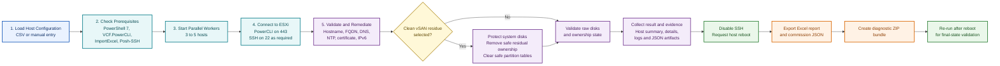

# VCF 9.1 ESXi Readiness and JSON Generator

`VCF91-ESX-Validation-JSON-Generator-v1.7-Enhanced-IPv6-Diagnostics.ps1` is a PowerShell 7 WPF utility for validating, remediating, and documenting ESXi host readiness before VCF 9.1 commissioning. The utility also generates bulk host commission JSON and creates a consolidated diagnostic ZIP bundle for troubleshooting.

> **Current release:** v1.7 Enhanced IPv6 Diagnostics  
> **PowerCLI requirement:** `VCF.PowerCLI`  
> **Execution model:** PowerShell 7, Windows STA, WPF, 3 to 5 parallel host workers


## Key capabilities

- Processes 3, 4, or 5 ESXi hosts in parallel using isolated hidden PowerShell 7 workers.
- Validates and optionally remediates hostname, lowercase FQDN, DNS, search domain, NTP, certificate, and IPv6 configuration.
- Validates ESXi 9.1 or later.
- Validates raw vSAN disk eligibility and detects existing vSAN ownership.
- Provides optional guarded OSA or ESA residual-disk cleanup.
- Disables SSH and requests a reboot after successful host processing.
- Exports an Excel readiness report with host summaries and detailed evidence.
- Generates VCF 9.1 bulk host commission JSON.
- Writes detailed run logs, per-host IPv6 JSON evidence, exception artifacts, and a ZIP diagnostic bundle.
- Masks passwords in the UI and warns when plaintext credentials are written to CSV or JSON.

## Repository layout

```text
VCF91-ESX-Validation-JSON-Generator-v1.7-Enhanced-IPv6-Diagnostics.ps1
README.md
wiki/
  VCF91-ESXi-Readiness-and-JSON-Generator.md
images/
  VCF91-ESXi-Readiness-Workflow.png
```

## Workflow


```mermaid
flowchart LR
    classDef input fill:#EAF2FF,stroke:#1456B8,stroke-width:2px,color:#0B2C63
    classDef connect fill:#E8F7F8,stroke:#087C89,stroke-width:2px,color:#074B52
    classDef validate fill:#F4ECFA,stroke:#71358F,stroke-width:2px,color:#4A1F60
    classDef output fill:#FFF2E5,stroke:#D96500,stroke-width:2px,color:#8C3D00
    classDef complete fill:#EAF7EA,stroke:#237A2D,stroke-width:2px,color:#15511C
    classDef decision fill:#FFF8D8,stroke:#A47A00,stroke-width:2px,color:#5E4700

    A[1. Load Host Configuration<br/>CSV or manual entry]:::input --> B[2. Check Prerequisites<br/>PowerShell 7, VCF.PowerCLI,<br/>ImportExcel, Posh-SSH]:::connect
    B --> C[3. Start Parallel Workers<br/>3 to 5 hosts]:::connect
    C --> D[4. Connect to ESXi<br/>PowerCLI on 443<br/>SSH on 22 as required]:::connect
    D --> E[5. Validate and Remediate<br/>Hostname, FQDN, DNS,<br/>NTP, certificate, IPv6]:::validate
    E --> F{Clean vSAN residue<br/>selected?}:::decision
    F -->|No| G[Validate raw disks<br/>and ownership state]:::validate
    F -->|Yes| H[Protect system disks<br/>Remove safe residual ownership<br/>Clear safe partition tables]:::validate
    H --> G
    G --> I[Collect result and evidence<br/>Host summary, details,<br/>logs and JSON artifacts]:::validate
    I --> J[Disable SSH<br/>Request host reboot]:::complete
    J --> K[Export Excel report<br/>and commission JSON]:::output
    K --> L[Create diagnostic ZIP bundle]:::output
    L --> M[Re-run after reboot<br/>for final-state validation]:::complete
```

## Requirements

- Windows workstation or server with an interactive WPF-capable session.
- PowerShell 7 or later.
- `VCF.PowerCLI`.
- `ImportExcel` for `.xlsx` reporting. CSV fallback is used when unavailable.
- `Posh-SSH` for ESXi shell validation and remediation.
- HTTPS TCP 443 from the automation host to every target ESXi host.
- SSH TCP 22 while shell-level checks and remediation are performed.
- DNS and NTP connectivity from each ESXi host.
- SDDC Manager HTTPS connectivity when Network Pool inventory or commission JSON generation is used.
- Administrative ESXi credentials for the requested validation and remediation operations.

## Launch

```powershell
pwsh -NoProfile -ExecutionPolicy Bypass -File .\VCF91-ESX-Validation-JSON-Generator-v1.7-Enhanced-IPv6-Diagnostics.ps1
```

The script creates or reuses a Current User code-signing certificate, trusts the certificate locally, signs the script, and relaunches in PowerShell 7 STA mode when required.

## Input CSV

```csv
TargetHost,Username,Password,DnsServers,SearchDomains,NtpServers
pod01esx12.corp.example.com,root,ExamplePassword,192.0.2.10;192.0.2.11,corp.example.com,time1.example.com;time2.example.com
```

| Column | Description |
|---|---|
| `TargetHost` | ESXi FQDN. The script normalizes the value to lowercase. |
| `Username` | ESXi account. Blank values default to `root`. |
| `Password` | ESXi password used for PowerCLI and SSH. |
| `DnsServers` | Semicolon, comma, or space-delimited desired DNS servers. |
| `SearchDomains` | Desired domain and search suffix values. |
| `NtpServers` | Semicolon, comma, or space-delimited desired NTP servers. |

> **Security warning:** Saved target CSV files and generated commission JSON files contain passwords in plaintext. Apply restrictive NTFS permissions and delete the files when they are no longer required.

## Validation stages

### Host identity and DNS

- Sets and verifies the short hostname, lowercase FQDN, primary domain, DNS servers, and search suffix.
- Validates forward A and reverse PTR resolution from the automation host.
- Requires the PTR result to match the lowercase FQDN.
- Performs DNS queries from the ESXi host to the configured DNS servers.

### NTP and time drift

- Compares desired and current NTP servers.
- Applies the requested configuration when remediation is enabled.
- Enables and starts the NTP service.
- Retries peer-selection checks up to 10 times.
- Restarts NTP after attempt 5 when no peer has been selected.
- Records signed and absolute host time drift.

### Certificate

- Validates that the certificate subject or SAN contains the lowercase ESXi FQDN.
- Runs `/sbin/generate-certificates` when remediation is enabled and the certificate does not match.
- Relies on the final host reboot to reload the generated certificate.

### IPv6 remediation and verification

Version 1.7 no longer treats an issued IPv6 command as proof of success.

The script now:

1. Captures the persistent IPv6 state before remediation.
2. Attempts remediation through the PowerCLI `Net.IPv6Enabled` advanced setting.
3. Executes both ESXCLI remediation paths and captures their return codes.
4. Re-queries `/Net/IPv6Enabled` after remediation.
5. Returns `Remediated` only when the persistent value is verified as disabled.
6. Returns `Fail` when the persistent disabled state cannot be verified.
7. Writes a per-host JSON artifact containing before state, command output, return codes, after state, and exception details.

A reboot is still required before all runtime interfaces, management components, and the DCUI reflect the final state. Re-run readiness after reboot for final-state confirmation.

### vSAN validation

With cleanup disabled, validation passes when:

- At least one raw data disk is eligible for vSAN or an eligible Storage Pool state is reported.
- No meaningful vSAN ownership entry is present.
- Expected ineligibility of the ESXi boot or system disk is ignored.

### Guarded residual cleanup

`Clean vSAN residue` is destructive and must be selected explicitly. The script protects:

- Mounted VMFS extents.
- Active core-dump devices.
- ESXi boot, system, OSData, and locker devices.
- Non-local disks.

For remaining eligible local disks, the script attempts vSAN ownership removal, clears the partition table through the host storage API, rescans storage, and re-runs validation.

## Outputs

Each launch creates a timestamped run directory:

```text
VCF91-Validation-Json-Run-YYYYMMDD-HHMMSS\
```

Typical contents include:

```text
ValidationJson-YYYYMMDD-HHMMSS.log
VCF91-ESX-Validation-YYYYMMDD-HHMMSS.xlsx
validation-targets.csv
example-validation-targets.csv
bulk-commission-hosts-YYYYMMDD-HHMMSS.json
Debug-Artifacts\
  ####-timestamp-IPV6-host-remediation.json
  ####-timestamp-EXCEPTION-context.json
```

After readiness processing, the script also creates:

```text
VCF91-Validation-Json-Run-YYYYMMDD-HHMMSS.zip
```

The ZIP provides a single evidence bundle for troubleshooting and customer escalation.

## Report status values

| Status | Meaning |
|---|---|
| `Pass` | The current host state meets the validation requirement. |
| `Remediated` | The requested persistent change was applied and verified. A reboot may still be required. |
| `N/A` | The operation was not applicable or remediation was disabled. |
| `Fail` | Validation failed, remediation failed, or the expected state could not be verified. |

## Bulk commission JSON

The JSON Generator authenticates to SDDC Manager and loads Network Pool inventory using the active connection. The generated JSON contains host FQDN, username, password, storage type, and Network Pool name.

Protect the JSON because host passwords are stored in plaintext.

## Troubleshooting

### IPv6 remains enabled after reboot

- Review the host's IPv6 JSON artifact.
- Check `PowerCLI.Success`, `NetworkIpSetRC`, and `AdvancedSetRC`.
- Review `After.IntValue`, `After.GlobalValue`, and `After.VerifiedDisabled`.
- Confirm that the script reported `Remediated`, not `Fail`.
- Confirm the host actually rebooted.
- Re-run readiness after the reboot.

### UI log appears idle

Parallel workers write to the shared log. The main WPF process tails that file and streams new entries into the UI. Review the on-disk log if the UI appears delayed.

### Reboot reports a warning

A management disconnect immediately after `Restart-VMHost` can be expected. Confirm the reboot through the host management interface and re-run readiness after the host returns.

### New hosts show a vSAN failure

Review the detailed report for eligible disk count and existing ownership entries. A new host must have at least one eligible raw data disk, and blank ESXCLI objects are not treated as ownership.

## Operational safeguards

- Validate the script in a controlled environment before production use.
- Confirm every target host before selecting remediation.
- Use residual-disk cleanup only after independently confirming disk identity and data disposition.
- Retain the diagnostic ZIP for failed runs.
- Restrict access to run directories because they can contain infrastructure details and plaintext secrets.
- Re-run validation after reboot before considering the host ready for commissioning.

## Release notes

### v1.7 Enhanced IPv6 Diagnostics

- Removed silent IPv6 command success handling.
- Added PowerCLI advanced-setting remediation.
- Captures ESXCLI return codes and command output.
- Verifies persistent IPv6 state before returning `Remediated`.
- Returns `Fail` when IPv6 cannot be verified as disabled.
- Adds per-host IPv6 JSON artifacts.
- Adds structured exception artifacts.
- Adds an end-of-run ZIP diagnostic bundle.

### v1.6

- Corrected blank ESXCLI vSAN result objects being interpreted as ownership.
- Counted eligible raw disks while ignoring expected boot and system-device ineligibility.
- Retained parallel processing, live UI logging, guarded cleanup, reporting, JSON generation, SSH shutdown, and reboot handling.

## Disclaimer

Review and test this utility under organizational change-control, security, and operational standards. Host remediation, reboot, certificate regeneration, and disk cleanup can affect availability. Residual-disk cleanup can permanently erase data when an incorrect disk is selected or protection logic is defeated by unexpected platform behavior.


