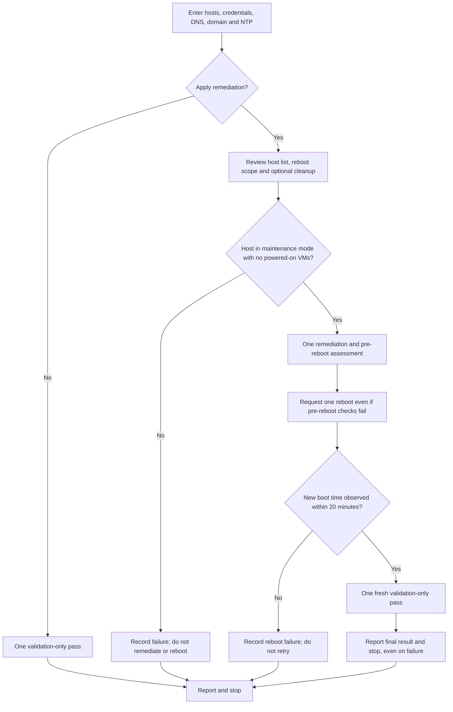

# VCF 9.1 ESX Host Validation and JSON Generator

`VCF91-ESX-Validation-JSON-Generator-v1.7.4.ps1` is a Windows PowerShell 7 WPF utility for ESX host readiness checks, optional remediation, and bulk host commission JSON generation. This README describes the behavior of **v1.7.4**, including its simplified remediation control and bounded, automatic post-reboot validation.

> **Release:** v1.7.4  
> **Runtime:** PowerShell 7 on Windows, interactive WPF session  
> **Modules:** `VCF.PowerCLI`, `ImportExcel`, `Posh-SSH`  
> **Execution:** 3 to 5 isolated host workers concurrently

## Choose the run mode

| UI selection | Behavior |
| --- | --- |
| **Apply remediation** unchecked (default) | Run the host readiness checks without requesting remediation or a reboot. The tool may temporarily start SSH to perform checks and disables SSH afterward. |
| **Apply remediation** checked | For each eligible host, perform one remediation pass, request **one** reboot, wait for a changed boot time, perform **one** fresh validation-only pass, and stop regardless of the final result. |
| **Clean vSAN residue** checked | Run the optional destructive disk-cleanup routine during remediation. This control is available only when **Apply remediation** is checked and requires a separate warning acknowledgment. |

There is **no separate Reboot + revalidate checkbox**. In v1.7.4, reboot and one post-reboot validation pass are inseparable parts of the **Apply remediation** workflow. The run-review dialog shows the target hosts, run mode, reboot scope, and cleanup selection before the run starts. Selecting **Yes** authorizes the displayed scope; selecting **No** cancels it.

**Important:** Checking **Apply remediation** does not guarantee that every listed host will reboot. Each host must pass the reboot preflight before remediation begins. The tool does not put hosts into maintenance mode, evacuate VMs, or automatically take hosts out of maintenance mode afterward.

## Remediation and post-reboot workflow


```mermaid
flowchart TD
    A[Enter hosts, credentials, DNS, domain and NTP] --> B{Apply remediation?}
    B -->|No| V[One validation-only pass]
    V --> Z[Report and stop]
    B -->|Yes| C[Review host list, reboot scope and optional cleanup]
    C --> D{Host in maintenance mode with no powered-on VMs?}
    D -->|No| F[Record failure; do not remediate or reboot]
    D -->|Yes| E[One remediation and pre-reboot assessment]
    E --> R[Request one reboot even if pre-reboot checks fail]
    R --> W{New boot time observed within 20 minutes?}
    W -->|No| T[Record reboot failure; do not retry]
    W -->|Yes| P[One fresh validation-only pass]
    P --> Q[Report final result and stop, even on failure]
    F --> Z
    T --> Z
    Q --> Z
```

For each host in remediation mode:

1. Confirm that the host is **already in maintenance mode** and that **zero VMs are powered on**. If the preflight fails, the host is not remediated or rebooted.
2. Apply the selected configuration and record pre-reboot findings. Checks include hostname/FQDN, DNS, NTP, certificate, ESX version, IPv6, and vSAN readiness. **Pre-reboot overall `Fail` does not itself suppress the authorized reboot** after the preflight succeeds.
3. Recheck maintenance mode and powered-on VMs immediately before the reboot request. The script issues at most **one** `Restart-VMHost` request for that host, without `-Force`. If the API loses the acknowledgment, the script waits for evidence of a reboot rather than sending another request.
4. Poll for host management connectivity and verify that the reported **boot time is later than the pre-reboot boot time**. The configured wait is **1,200 seconds (20 minutes)**. A timeout or failed preflight is reported as a reboot-verification failure; the tool does not attempt a second reboot.
5. Only after the reboot is verified, run **one validation-only pass**. Remediation, vSAN cleanup, and reboot authorization are disabled for this pass. The host workflow ends regardless of whether the final result is `Pass` or `Fail`.

The script does **not** automatically exit maintenance mode. Review the final report and host state before returning a host to service. The host workflow's validation-only pass can temporarily start SSH and disables it afterward; it does not request a reboot.

> **Operational caution:** A run can have 3 to 5 host workers active at once. If simultaneous reboots are not authorized, run a single target host per launch or adjust the workflow under change control. The parallel-node selector is not a one-host throttle.

## Requirements and preparation

- Windows with an interactive desktop session and PowerShell 7 or later.
- The `VCF.PowerCLI`, `ImportExcel`, and `Posh-SSH` modules. The three install buttons each install their named module.
- Administrative ESX credentials for every target host. Password cells are **blank when no password is present** and show stars only after a password has been entered or loaded. Missing target passwords block readiness and JSON generation.
- HTTPS TCP 443 and SSH TCP 22 from the automation workstation to the target hosts; DNS and NTP connectivity appropriate for the checks.
- For remediation: approved change scope, a maintenance window, hosts already in maintenance mode, and zero powered-on VMs. Confirm vSAN and networking impact before disabling IPv6 or performing disk cleanup.
- For network-pool lookup: access to the SDDC Manager endpoint and appropriate credentials.

**Launch:**

```powershell
pwsh -NoProfile -ExecutionPolicy Bypass -STA -File ".\VCF91-ESX-Validation-JSON-Generator-v1.7.4.ps1"
```

The script may create or reuse a Current User code-signing certificate and relaunch in PowerShell 7 STA mode if needed. Its output directory is created under the current working directory.

## Host entry and CSV

Use **Add Host** or **Load CSV**. Populate the desired DNS servers, search domains, and NTP servers before running. An example CSV can be saved with **Save Example CSV**; the example does **not** contain a real password.

```csv
TargetHost,Username,Password,DnsServers,SearchDomains,NtpServers
pod01esx12.corp.example.com,root,ReplaceWithRealPassword,192.0.2.10;192.0.2.11,corp.example.com,time1.example.com;time2.example.com
```

- `TargetHost` is the ESX FQDN and is normalized to lowercase.
- `Username` defaults to `root` when empty.
- `Password` must be provided for each nonempty target host.
- DNS and NTP lists may use commas, semicolons, or spaces.
- **Save CSV** exports the current targets and desired configuration, including passwords **in plaintext**. Protect and delete the CSV according to your organization's credential-handling rules.

The UI displays a count of targets with entered passwords. **Stop Queuing New Hosts** prevents additional workers from starting and records queued hosts as skipped; it **does not cancel active workers**, their authorized remediation, or their authorized reboot. Wait for active workers and reporting to finish before closing the application.

## Checks and evidence

- **Host identity and DNS:** requested hostname, lowercase FQDN, DNS servers, domain/search suffix, workstation forward A and reverse PTR checks, and ESX DNS reachability.
- **NTP:** configured servers, service state, peer-selection checks, and time drift.
- **Certificate:** lowercase FQDN matching; generation is attempted in remediation mode if needed. Final state is assessed in the post-reboot pass.
- **IPv6:** v1.7's persistent-setting remediation and evidence collection, with v1.7.2's fail-closed handling of missing or contradictory values. IPv6 evidence artifacts retain before/after state and command results. A post-reboot failure is reported, **not** remediated again.
- **vSAN:** raw-disk eligibility and meaningful ownership detection. **Clean vSAN residue** is a separate, destructive opt-in and is never performed in the post-reboot pass.
- **Version:** installed ESX version is compared with the script's 9.1.0 minimum.

The Excel report includes **Hosts** and **Details** worksheets. In remediation mode, details distinguish `Pre-reboot / ...`, `Reboot verification`, and `Post-reboot / ...` checks. The host summary records the pre-reboot overall result, reboot status, post-reboot status, and final overall result. If reboot is not verified, the post-reboot pass is **not run**, and the host is reported as failed. A final `Fail` does not initiate another remediation cycle.

Each launch creates a timestamped `VCF91-Validation-Json-Run-YYYYMMDD-HHMMSS` directory containing the run log, Excel report when available, diagnostic artifacts, and worker stderr/stdout files where applicable. A diagnostic ZIP is created at the end of readiness processing. Worker startup failures include exit-code and stderr details rather than only `Worker returned no result`.

## JSON generator and credential security

The **JSON Generator** tab can authenticate to SDDC Manager, load network-pool names, and create a bulk commission JSON file. JSON generation is a **separate action**; running readiness does not automatically generate commission JSON. Generated JSON contains ESX host credentials **in plaintext**. Protect it, the target CSV, the run directory, and the diagnostic ZIP with appropriate access controls and retention practices. Do not attach these artifacts to an unrestricted ticket or share them without checking for secrets.

## Troubleshooting

### Remediation did not start

Check that every target has a password and all required configuration fields are populated. Confirm the pre-run dialog was accepted. For a host that did not proceed, review the **Connect/Run** and reboot-verification details, including whether maintenance mode and the powered-on-VM preflight succeeded. A host that fails preflight is not remediated or rebooted.

### Reboot was requested but not verified

Review the `Reboot verification` detail, the pre-reboot and observed boot times, host management reachability, and any worker stderr file. The tool does **not** issue another reboot when the first request loses acknowledgment or verification times out. Check host state out of band before taking manual action.

### Host returned but the final result is Fail

Review the `Post-reboot / ...` rows. The tool does **not** apply fixes again, clean disks again, or reboot again. Remediate any remaining issues only through a **new, separately reviewed run** after investigating the failure.

### IPv6 remains enabled after reboot

Compare the pre-reboot IPv6 artifact with the post-reboot IPv6 detail. Missing or contradictory persistent-state evidence is a failure, not a pass. Assess networking impact before deciding whether to run another remediation cycle.

### UI appears idle or workers exit immediately

Inspect the on-disk run log and `worker-*-stderr.log` files. Worker script and input/output paths are quoted to support run directories containing spaces. A worker error should appear in the report's Details sheet.

## Release notes

### v1.7.4: simplified remediation controls

- Removed the redundant, noninteractive **Reboot + revalidate** checkbox.
- **Apply remediation** is now the sole workflow selection for one remediation pass, one authorized reboot request, and one automatic validation-only post-reboot pass.
- Reboot authorization in the worker input is derived from **Apply remediation**; a mismatched worker input is rejected.
- Kept the separate **Clean vSAN residue** opt-in, run-review confirmation, maintenance-mode/zero-powered-on-VM preflight, boot-time verification, bounded wait, and no-retry behavior.

### v1.7.3: single reboot and automatic post-reboot validation

- Added three bounded phases: remediation/pre-reboot evidence, one reboot request with boot-time verification, and one validation-only post-reboot pass.
- Added a 20-minute reboot-verification wait. No reboot or remediation loop is performed.
- Made the post-reboot result the final result when the reboot is verified; retained pre-reboot findings separately.

### v1.7.2: safety and UI controls

- Defaulted to validation-only mode and added a target/mode confirmation.
- Added reboot preflight, accurate stop-queue behavior, explicit progress/mode text, and fail-closed IPv6 evidence handling.
- Made prerequisite installation buttons correspond to their named modules; added Save As behavior for the example CSV.

### v1.7.1: worker launch and password display

- Quoted worker paths containing spaces and captured worker stderr.
- Made empty password cells visibly empty and blocked runs with missing passwords.

### v1.7: IPv6 diagnostics

- Added persistent IPv6 before/after evidence, command-result artifacts, and the diagnostic ZIP.

## Operational note

This is an administrative automation tool, not an approval system. Review the selected hosts, planned reboots, networking dependencies, disk disposition, and diagnostic-artifact handling under your change-control process. Test with **one host first**. The script does not automatically return a host to service.

## Broadcom references

- ESX 9.x reboot and maintenance-mode procedure: https://knowledge.broadcom.com/external/article/394496/rebooting-shutting-down-esxi-host-vmwar.html
- PowerCLI `Restart-VMHost` and `-Force` behavior: https://developer.broadcom.com/powercli/latest/vmware.vimautomation.core/commands/restart-vmhost/
****


