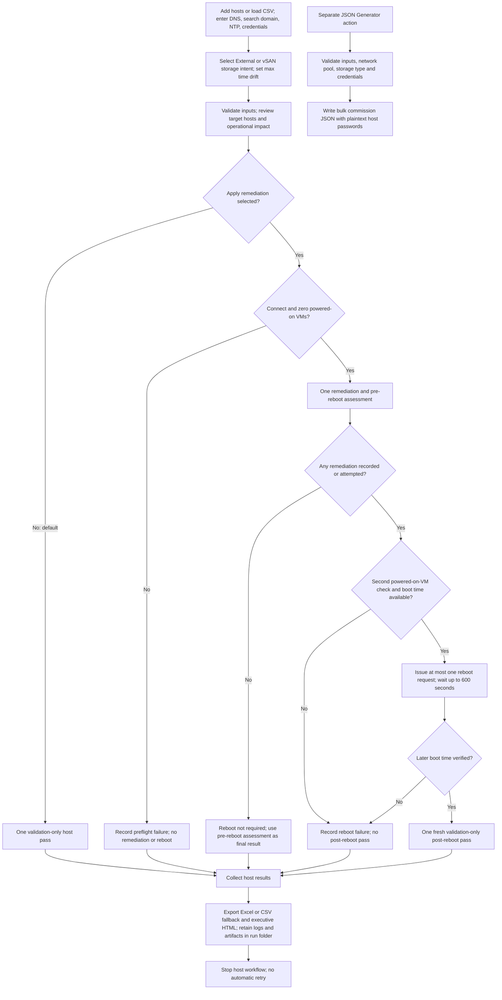

# VCF 9.1 ESXi Host Validation and JSON Generator

**Release:** v2.0  
**Platform:** Windows desktop, PowerShell 7 or later, WPF  
**Modules:** VCF.PowerCLI, ImportExcel, Posh-SSH  
**Concurrency:** 3 to 5 isolated host workers; selecting 3 does not require three target hosts.

This utility checks ESXi host readiness for VCF 9.1 commissioning, optionally remediates supported configuration, produces host and executive reports, and separately generates bulk host-commission JSON. Validation-only is the default. The JSON Generator is a separate UI action; running readiness does **not** automatically generate commission JSON.

## Workflow

The Mermaid diagram describes the actual host-worker branches. Report export follows readiness processing; JSON generation is independent and requires a separate button click.


```mermaid
flowchart TD
    A[Add hosts or load CSV; enter DNS, search domain, NTP, credentials] --> B[Select External or vSAN storage intent; set max time drift]
    B --> C[Validate inputs; review target hosts and operational impact]
    C --> D{Apply remediation selected?}
    D -- No: default --> V[One validation-only host pass]
    V --> R[Collect host results]
    D -- Yes --> P{Connect and zero powered-on VMs?}
    P -- No --> F[Record preflight failure; no remediation or reboot]
    F --> R
    P -- Yes --> M[One remediation and pre-reboot assessment]
    M --> Q{Any remediation recorded or attempted?}
    Q -- No --> N[Reboot not required; use pre-reboot assessment as final result]
    N --> R
    Q -- Yes --> X{Second powered-on-VM check and boot time available?}
    X -- No --> E[Record reboot failure; no post-reboot pass]
    E --> R
    X -- Yes --> Y[Issue at most one reboot request; wait up to 600 seconds]
    Y --> Z{Later boot time verified?}
    Z -- No --> E
    Z -- Yes --> W[One fresh validation-only post-reboot pass]
    W --> R
    R --> O[Export Excel or CSV fallback and executive HTML; retain logs and artifacts in run folder]
    O --> S[Stop host workflow; no automatic retry]
    J[Separate JSON Generator action] --> K[Validate inputs, network pool, storage type and credentials]
    K --> L[Write bulk commission JSON with plaintext host passwords]
```

**Interpretation:** A pre-reboot check may fail after a configuration change was attempted; that failure alone does not cancel an already authorized reboot. The workflow records whether a change was attempted; it does not prove that every attempted change succeeded. A reboot is never requested if the initial powered-on-VM preflight fails. The tool does not put a host into maintenance mode, evacuate VMs, or take a host out of maintenance mode. The reboot command uses `-Force` to permit a standalone host reboot without a maintenance-mode requirement. Standalone commissioning hosts do not need to be in maintenance mode for this script's preflight. Reboot verification requires a later boot time, not merely restored network connectivity. A lost API acknowledgement does not cause a second reboot request.

## Prerequisites and launch

- Run on **Windows** with an interactive desktop and **PowerShell 7+** in STA mode. The launcher can relaunch in PowerShell 7 STA mode and attempts to create, trust, and use a CurrentUser self-signed code-signing certificate. The supplied v2.0 script copy has no inherited Authenticode signature because its contents changed; review the trust behavior and sign the release using your approved process before deployment.
- Install **VCF.PowerCLI**, **ImportExcel**, and **Posh-SSH**. The UI includes a separate installation button for each module.
- Provide administrative credentials for each target ESXi host, management HTTPS/TCP 443 and SSH/TCP 22 connectivity, and functioning DNS and NTP paths for the checks. The tool may start SSH temporarily; it preserves an already-running SSH service and verifies that SSH is stopped if the tool started it.
- For remediation, obtain approved change scope and review effects of DNS/NTP/certificate/IPv6 changes and possible concurrent reboots. The UI offers 3, 4, or 5 parallel workers. For serialized changes, launch one target host at a time.
- Network-pool inventory lookup additionally needs SDDC Manager access and credentials. A network-pool name can instead be entered in the editable field.

Use the accompanying `VCF91-ESX-Validation-JSON-Generator-v2.0.ps1` file. Do not rename the older `.ps1.txt` source and assume its signature remains valid after editing. Example:

```powershell
pwsh -NoProfile -ExecutionPolicy Bypass -STA -File ".\VCF91-ESX-Validation-JSON-Generator-v2.0.ps1"
```

The script creates a timestamped run directory beneath the current working directory. This documentation review did not run the WPF UI or perform host-level integration tests.

## Configure hosts and credentials

Use **Add Host** or **Load Hosts**. Supply DNS servers, a primary search domain, NTP servers, and an explicit **Storage intent** of `External` or `vSAN`. Enter a maximum time drift in seconds; the UI defaults to **5**, and input validation accepts a number greater than 0 and no greater than **300**. Host FQDNs are normalized to lowercase, must match `<host>.<primary search domain>`, and must be unique. Blank usernames default to `root`.

Enter a password per host, or select **Use one password for all hosts** and enter it in the dedicated shared-password box. Shared mode shades and disables individual host password cells; the worker credential snapshot is checked before a run. A missing target password blocks both readiness and JSON generation. The UI displays blank individual password cells until a password is entered.

**Save Hosts** writes `validation-targets.csv` in the run folder with the password column **blank**, even if a password was entered. Re-enter passwords after loading that CSV. **Save Example Hosts** creates a password-free template. A loaded CSV can contain a `Password` field; treat any legacy or manually populated CSV with real passwords as sensitive. In shared-password mode, the dedicated shared-password box must be re-entered after loading. Current export fields are:

```csv
TargetHost,Username,Password,DnsServers,SearchDomains,NtpServers,StorageIntent,MaxDriftSeconds,SharedPasswordMode
esx01.corp.example.com,root,,192.0.2.10;192.0.2.11,corp.example.com,time1.example.com;time2.example.com,External,5,False
```

## Run modes and safety

### Validation only (default)

Leave **Apply remediation** unchecked. The tool performs one host pass, collects evidence, and does not request host remediation, vSAN disk cleanup, or a reboot. Temporary SSH startup and restoration may still occur for host-side checks. The report records `RebootStatus` and `PostRebootStatus` as `N/A`.

### Apply remediation

Check **Apply remediation**, review the exact host list and risk text, acknowledge the impact, and select **Start run**. The script requires **zero powered-on VMs** before it begins host changes and checks again immediately before a reboot. Maintenance mode is **not** a preflight requirement. The tool does not evacuate VMs or manage maintenance mode.

For each eligible host, the tool performs one remediation/pre-reboot assessment. If no remediation was recorded **and** no mutation was attempted, it reports `RebootStatus: Not required` and uses that assessment as the final result. If a mutation was attempted or recorded, it requests **at most one** reboot using `Restart-VMHost -Force`, waits up to **600 seconds (10 minutes)** for a boot time later than the pre-reboot value, then runs **exactly one** fresh validation-only pass if reboot verification succeeds. It never automatically retries remediation or reboot. A reboot timeout or failed reboot preflight prevents post-reboot validation and is reported as failure.

**Clean vSAN residue is disabled.** The checkbox is disabled and worker input requesting cleanup is rejected. No automatic disk wiping or vSAN partition removal is part of this release. Investigate storage residue with a separately approved procedure.

**Stop Queuing New Hosts** skips targets that have not started; it does **not** cancel active workers, already-authorized changes, or reboot requests. The application blocks closing while a run is active and waits for active workers before reporting.

## Checks and interpretation

- **Identity and DNS:** hostname, FQDN, domain, configured DNS list, workstation forward A and reverse PTR lookups against each specified DNS server, and functional host-side DNS queries. DNS source-interface binding is **not guaranteed** by the diagnostic output.
- **NTP and clock:** configured NTP servers and service, host-side NTP-name resolution, observed peer replies and selected-peer synchronization, plus UTC drift against the configured threshold. The synchronization loop samples up to **20 times** at approximately **10-second** intervals. A UDP port probe is not treated as proof of an NTP reply; a conditional NTP service restart can occur in remediation mode.
- **Certificate:** checks whether the presented certificate has the expected lowercase host FQDN name. **Chain trust and certificate-expiration validation are not performed.** Remediation can run certificate generation when the name check fails; final state is assessed after a verified reboot.
- **IPv6:** checks the ESX global network IPv6 state, with an optional advanced-setting cross-check when available. Missing or contradictory evidence fails closed. A disable request in remediation mode requires reboot and subsequent validation to establish the final state.
- **Storage intent and vSAN:** checks disk/ownership evidence even for external-storage hosts. `External` returns `N/A` only when the required evidence is available and no vSAN ownership or identifiable residue is found; missing evidence or ownership fails. `vSAN` requires at least one eligible raw disk and no detected ownership/residue. Partitioned disks are **not** automatically classified as vSAN residue on external-storage hosts.
- **Version and SSH:** requires installed ESX **9.1.0 or later** and records SSH cleanup/restoration status. An unverified SSH cleanup can fail the host result.

Check details can show **Pass**, **Fail**, **Remediated**, **N/A**, **Pending**, or **Not run**; the host summary can also show **Skipped** for a target that was never started. `N/A` for external-storage disk eligibility is not a failed vSAN test. A `Pending` NTP result is not an overall Pass. When preflight or connection fails, checks that never started are marked `Not run` rather than implying they passed.

## Reports, artifacts, and security

Each launch creates `VCF91-Validation-Json-Run-YYYYMMDD-HHMMSS` under the current working directory. The run directory is the **log bundle**; **no diagnostic ZIP is created**. It contains the timestamped run log, `Debug-Artifacts` JSON evidence, worker stdout/stderr and result files where applicable, the readiness workbook or CSV fallback, generated bulk-commission JSON if requested, and a `Reports` subfolder for the executive HTML report.

The workbook contains `Hosts` and, when detail rows exist, `Details` worksheets. If Excel export fails or ImportExcel is unavailable, the script writes host and detail CSV reports instead. The executive HTML report contains final host-outcome and validation-result charts, a host summary, and individual host details; N/A and not-run checks are separated from applicable pass counts. When a readiness report is written, the script attempts to open the HTML report automatically. **Open Run Folder** opens the run directory in Explorer without requiring an Excel file association.

In remediation mode, details distinguish `Pre-reboot / ...`, `Reboot verification`, and, only after a verified reboot, `Post-reboot / ...`. The final host result is the post-reboot assessment if one runs; if no change was attempted, the initial assessment is final. A failed or unverified reboot does not trigger another pass.

Worker input uses a Windows user-scoped protected password representation and the input file is normally removed after collection; this does **not** make the entire run directory secret-free. **Bulk commission JSON contains host passwords in plaintext.** Protect JSON, any password-bearing imported CSV, logs, diagnostics, worker output, and the run directory according to your access-control and retention policies. Review artifacts before attaching them to tickets.

## Generate commission JSON (separate action)

On the **JSON Generator** tab, optionally connect to SDDC Manager to load network-pool names, or type a network-pool name. Select a JSON storage type explicitly: `vSAN OSA`, `vSAN Remote`, `vSAN ESA`, `vSAN Max`, `NFS`, `VMFS on FC`, or `vVol`. The selected JSON type must agree with the `vSAN` or `External` host storage intent. Complete host credentials and required desired-configuration fields, then click **Generate JSON**. The tool writes `bulk-commission-hosts-YYYYMMDD-HHMMSS.json` into the run folder and attempts to open it in Notepad. This action is independent of whether readiness was run or passed; review readiness results before using the file for commissioning.

## Troubleshooting

- **Run rejected before workers start:** check required DNS/search-domain/NTP fields, unique FQDNs matching the primary domain, explicit storage intent, valid drift threshold, and complete per-host or shared credentials. Review the run-review acknowledgment.
- **Host was not remediated:** inspect `Connect/Run` and `Pre-reboot / ...` details. A failed connection or powered-on-VM preflight blocks host changes and reboot; maintenance mode alone does not block a standalone host.
- **No reboot in remediation mode:** `RebootStatus: Not required` means no remediation was recorded or attempted. A failed preflight instead reports no reboot and a failed host result.
- **Reboot requested but not verified:** inspect boot times, management reachability, reboot detail, run log, and worker stderr. The script does not send a second request after lost acknowledgement or timeout. Verify host state independently before manual action.
- **Host returned but overall Fail:** inspect `Post-reboot / ...` rows, including NTP, IPv6, certificate name, storage classification, and SSH cleanup. A new remediation attempt requires a separately reviewed run.
- **External-storage host shows vSAN Fail:** inspect `vdq`, vSAN ownership entries, and ESA storage-pool query evidence. The script does not turn unavailable evidence into `N/A` and does not automatically clean disks.
- **No Excel report:** check for the host/detail CSV fallback and executive HTML under `Reports`; inspect the run log for export errors.
- **UI appears idle or workers fail:** inspect the run log and `worker-*-stderr.log`; failed workers should be represented in the collected results when possible.

## v2.0 release baseline

This README describes the accompanying v2.0 script: shared-password UI; explicit storage intent and configurable time drift; standalone-host powered-on-VM preflight without maintenance-mode gating; conditional single reboot with a 600-second boot-time check; disabled vSAN cleanup; password-free saved CSV; Excel/CSV and executive HTML reporting; run-folder bundle without ZIP; and independent bulk commission JSON generation. All active script version labels are v2.0; the prior embedded signature was removed from the modified copy and must not be treated as valid.

**Operational note:** This tool is not a change-approval or host-commissioning approval system. Test with one host first, review network and storage impact, and confirm final host state before returning a host to service.

## Broadcom command reference

- [Restart-VMHost (`-Force` and `-Evacuate` semantics)](https://developer.broadcom.com/powercli/latest/vmware.vimautomation.core/commands/restart-vmhost/)
- [Get-VMHostService](https://developer.broadcom.com/powercli/latest/vmware.vimautomation.core/commands/get-vmhostservice/)
